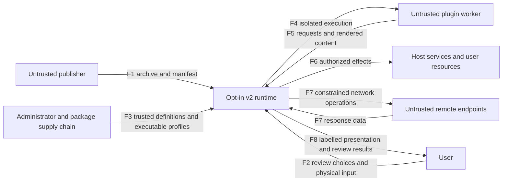
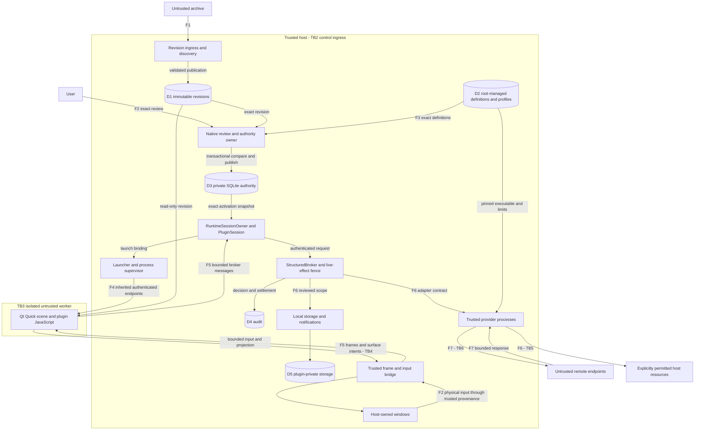
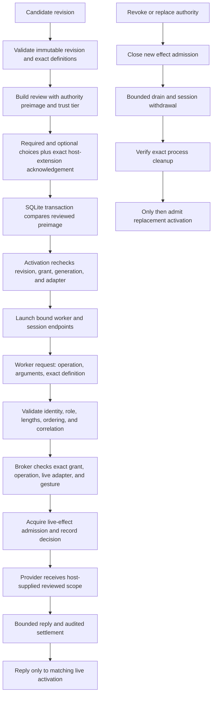
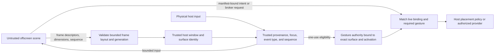

# Plugin runtime threat model

Assessment date: 2026-09-07. Implementation baseline: `f784fd9591934fa8e5d4516cd12562251bc0cc5f`. Scope: the opt-in schema-v2 POC described in [Secure plugin runtime POC](plugin-security.md), not the production desktop, schema-v1 plugins, or unrelated Omarchy commands.

Status: architecture and initial STRIDE assessment documented; requested black-box and white-box agent penetration tests are **pending**. Both agent invocations were rejected by the service's cybersecurity access check before returning assessment results. There are no completed agent test cases or confirmed vulnerability findings from those invocations. This document must not be described as a completed penetration test, independent audit, or release approval.

## Objectives, assets, and assumptions

The principal adversary is a malicious plugin publisher or compromised plugin worker. Treat every worker byte, image, descriptor, and timing choice as hostile, including after consent. A remote endpoint can return hostile content through an approved provider. A malicious archive is hostile before it is installed or reviewed.

Protect host files and credentials, permission integrity, exact revision identity, user input and compositor authority, host availability, other plugins' state, and evidence of authorization decisions. Preserve the distinction between a bounded sandboxed effect and an explicitly approved host extension.

The kernel, systemd, Bubblewrap, Qt/native runtime, SQLite, trusted shell, root-managed definitions, and provider implementations form the trusted computing base. Host same-UID arbitrary code, root compromise, and an explicitly approved unrestricted interpreter are not confined by the worker boundary. These exclusions are assumptions, not evidence that those compromises are harmless. The same-UID control socket cannot establish human intent. Schema v1 remains trusted in-shell execution.

The assessment permits synthetic fixtures and isolated local test processes only. It does not authorize changes to live authority, installed plugins, host configuration, real credentials, third-party services, or production availability. Package installation and root-owned lifecycle verification require separate authorization and an appropriate disposable environment.

## Architecture notation

L0 means system context, L1 means runtime decomposition, and L2 means detailed security-sensitive flows. These are diagram levels, not privilege rings. Rectangles are actors/processes, cylinders are stores, arrows name data flows, and named subgraphs identify major trust zones. The boundary table is authoritative where a boundary is more specific than a diagram box. Reverse arrows carry separately validated responses; they do not grant the sender authority.

### L0: system context

### L1: processes, stores, and trust zones

Provider processes are trusted adapters, not another copy of the worker sandbox. Media playback adds its own networkless namespace. The package/administrator boundary and persistent-storage boundary apply inside the host zone even though they are not separate OS users in this drawing.

### L2: consent, dispatch, and revocation

Reject paths are omitted for readability, not optional: stale review, missing required authority/provider, malformed messages, ambiguous persistence, failed audit, and invalid session identity must not reach an external effect. Revocation cannot undo a completed external action or uninstall a separately approved package.

### L2: presentation and gesture provenance

Worker pixels cannot mint a gesture or select native placement authority. They can still deceive a user visually; memory isolation does not establish that a plugin's displayed claims are true.

## Trust boundaries and enforcement owners

| Boundary | Crossing and protected property | Implementation owner |
| --- | --- | --- |
| TB1: publisher to installed revision | F1: archive paths, entry types, sizes, manifest identity, and publication must not change unrelated host files or grant permission. | `discovery/src/revision_ingress.cpp`, `contracts/manifest/`, `contracts/capability-definitions/` |
| TB2: host control to authority | F2: review choices must match exact revision, definitions, preimage, and trust tier. Same-UID host control is trusted, not human authentication. | `host-session/src/consent_review.cpp`, `authority_store.cpp`, `channel-integration/src/plugin_permission_authority.hpp` |
| TB3: host to worker | F4/F5: namespace, descriptors, seccomp, resource limits, authenticated endpoint roles, generations, and message bounds. | `launcher/`, `contracts/sandbox/`, `contracts/wire/`, `channel-integration/src/plugin_session_io.cpp` |
| TB4: worker presentation to compositor/input | F5/F8: hostile pixels and intents never become arbitrary native windows, pointers, allocations, or synthetic gesture authority. | `contracts/surface/`, `surface-host/`, `trusted-bridge/`, `host-session/src/gesture_eligibility.cpp` |
| TB5: broker to effect/provider | F6: exact scope and operation, live admission, pinned adapter/executable, bounded process/reply lifetime. Approved host commands retain their explicitly granted host authority. | `host-session/src/structured_broker.cpp`, `providers/`, `provider-host/` |
| TB6: provider to remote endpoint | F7: origin/method limits, public-address checks, redirect policy, bounded content; returned data remains untrusted. | `provider-host/src/network_media_provider.cpp` |
| TB7: persistent state to current authority | D1/D3/D4/D5: private descriptor-rooted state, exact identity, transactional preimages, migration cutover, and failure handling. | `discovery/`, `host-session/src/sqlite_authority_database.cpp`, `authority_migration.cpp`, `audit/src/audit_store.cpp`, `providers/` |
| TB8: administrator/package to trusted code | F3/D2: root-owned definitions, profiles, executable pins, recognized enforcement contracts, and package integrity. | `contracts/capability-definitions/src/capability_definition_loader.cpp`, `provider-host/src/provider_catalog.cpp`, `packaging/` |

## STRIDE register

STRIDE categories follow [Microsoft's threat definitions](https://learn.microsoft.com/en-us/azure/security/develop/threat-modeling-tool-threats): spoofing (S), tampering (T), repudiation (R), information disclosure (I), denial of service (D), and elevation of privilege (E). The following scenarios are assessment hypotheses and residual risks, **not confirmed vulnerabilities**. Coverage pointers identify existing regression assets; they do not assert a fresh run or complete protection.

Priority is qualitative review urgency: P1 targets host authority or broad host impact, P2 targets bounded integrity/availability or consequential usability risks. It is not a CVSS score or a measured likelihood. Until testing establishes reachability, estimating numerical likelihood would imply unsupported precision.

| ID | STRIDE / boundary | Threat and potential consequence | Existing control and coverage pointer | Residual question / priority |
| --- | --- | --- | --- | --- |
| T01 | T/E, TB1 | Archive traversal, links, or revision replacement writes outside ingress or changes reviewed code. | Bounded ingress and immutable revisions; `discovery/tests/revision_ingress_test.cpp`. | Independently exercise archive edge cases and concurrent replacement; P1. |
| T02 | S/T/E, TB2/TB7 | Replay a stale review or broaden an optional choice to publish unintended authority. | Exact preimage transaction, definition pins, separate host-tier acknowledgement; `host-session/tests/consent_review_test.cpp`, `authority_store_test.cpp`. | Interleavings across simultaneous review/revoke owners; P1. |
| T03 | S/E, TB3/TB5 | Another activation's request or reply is accepted, or worker arguments substitute authority scope. | Native binding, role/correlation checks, exact broker routes, host-owned scope; `channel-integration/tests/authenticated_channel_test.cpp`, `host-session/src/structured_broker.cpp`. | Independent authenticated-protocol tests remain pending; P1. |
| T04 | T/E, TB5/TB7 | Revoked authority survives through queued work, stale callbacks, or replacement. | Admission fencing, bounded draining, exact generation/epoch checks; `channel-integration/tests/plugin_session_test.cpp`, `runtime_session_owner_test.cpp`. | Confirm race coverage at actual effect time, not only projections; P1. |
| T05 | I/E, TB3 | Worker reaches host files, session bus, network, native modules, or inherited descriptors. | Bubblewrap closure, descriptor ownership, seccomp; `contracts/sandbox/tests/enforcement_test.cpp`. | Closure mechanism verified as real root on QEMU (10/10 probes, see results doc); full packaged end-to-end bridge verified PASS on the live host (production supervisor + real systemd scope + packaged worker + bwrap, see results doc). Upstream TCB vulnerabilities remain separate work; P1. |
| T06 | T/D/E, TB4 | Hostile frames or descriptors cause oversized allocation, stale access, or host memory corruption. | Checked frame layouts, descriptor validation, surface generation; `contracts/surface/tests/frame_region_test.cpp`, `layout_test.cpp`. | Independent boundary-value campaign and sustained load; P1. |
| T07 | S/E, TB4/TB5 | Synthetic/repeated input or another surface supplies gesture authority. | Physical provenance, focus and event checks, one-use exact binding; `host-session/tests/gesture_eligibility_test.cpp`, `gesture_intent_test.cpp`. | Real compositor provenance verified PASS on a live display: a genuine gesture ingressed as accepted+trusted-physical=true and consumed the one-use binding (see results doc); P1. |
| T08 | I/E, TB6 | Approved origin reaches private services through DNS, redirects, or media handling. | Public-address validation, fetch redirect denial, bounded media redirects; `provider-host/tests/network_media_provider_test.py`. | Connection-time policy exercised end-to-end on QEMU (6/6 through real resolver/curl, see results doc); P1. |
| T09 | T/E, TB5/TB8 | Provider pathname, profile, executable, or adapter alias is replaced to execute different host code. | Root-owned catalog, digest/open descriptor pinning, `execveat`, alias rejection; `provider-host/tests/provider_host_test.cpp`, `contracts/capability-definitions/tests/capability_definition_loader_test.cpp`. | Root-owned package lifecycle repeat remains unverified; P1. |
| T10 | I/T/E, TB5 | Approved interpreter, mutable script, credential-enabled command, or AUR dependency exceeds the user's intended trust. | Host-extension tier and exact acknowledgement; package installation is separate consent; `provider-host/tests/command_executor_test.cpp`. | Accepted authority can still cause user harm; review comprehension and narrower scopes need evaluation. Not a demonstrated sandbox escape; P1. |
| T11 | T/E, TB7 | Corrupt, missing, or rolled-back database resurrects legacy grants or publishes torn authority. | SQLite transaction, restricted VFS, cutover stamp, poison-on-ambiguity; `host-session/tests/sqlite_authority_database_test.cpp`, `authority_sql_test.cpp`, `authority_store_test.cpp`. | Physical power-loss exercised in QEMU (25/25 trials, see results doc); hostile same-UID rollback remains unverified; P1. |
| T12 | R/D, TB5/TB7 | An effect lacks a trustworthy decision/settlement record, or audit failure leaves authority active. | Audit checks and failure closure; `audit/tests/audit_store_test.cpp`, `channel-integration/tests/broker_session_settlement_test.cpp`. | Local records are not remote tamper-proof or proof of human consent; P2. |
| T13 | I/T, TB7 | Plugin storage escapes its root or leaks another plugin's data. | Descriptor-rooted private provider storage; `providers/`. | Independent namespace, path, quota, and concurrent access cases; P1. |
| T14 | D, TB3/TB4/TB5 | Message/render storms, repeated activation, or failed provider cleanup exhaust host resources. | Bounded queues/frames, scopes, deadlines, retained pidfd/unit cleanup; `launcher/`, `channel-integration/tests/runtime_session_owner_test.cpp`, `provider-host/tests/provider_host_test.cpp`. | Aggregate multi-plugin budget and sustained compositor responsiveness remain unmeasured; P2. |
| T15 | S/I, TB4 | Plugin draws a fake trusted prompt or asks a user to enter secrets into its scene. | Host owns review and effect authority; worker scenes are untrusted content. | Host ownership alone does not prevent visual phishing. Evaluate unmistakable origin and trusted-review distinction before wider use; P1. |
| T16 | S/T/E, TB8 | Compromised package/admin definition alters enforcement or trusted review text. | Fixed package payload and ownership/pinning checks; `packaging/`, `contracts/capability-definitions/`. | Trusted supply-chain compromise is outside the worker guarantee; signing/update provenance needs its own assessment; P1. |

## CVSS scoring and finding states

The requested “CVE calculator” is interpreted as the [FIRST CVSS v4.0 calculator](https://www.first.org/cvss/calculator/v4-0). CVE identifiers identify published vulnerability records; this assessment does not assign them. CVSS communicates vulnerability severity, not overall project risk. The [CVSS v4.0 specification](https://www.first.org/cvss/v4.0/specification-document) distinguishes Base, Threat, Environmental, and Supplemental metrics.

No numeric vulnerability scores are reported yet: no completed agent findings exist, and a blocked assessment is not a score of 0.0. The STRIDE scenarios are not evidence that their assumed control failures exist. A future conditional scenario score must be explicitly labelled hypothetical and must not appear in the confirmed-findings count.

For each confirmed finding, record the affected baseline and component, attacker position, required grant and user interaction, reproducible evidence, actual impact, complete `CVSS:4.0` vector, calculator result/link, and scoring rationale. Distinguish impact to the vulnerable component from subsequent host systems; do not assume full host compromise from a worker crash. State assumptions for every metric, retain the pre-fix score after mitigation, and record retest evidence separately. Use `not scored` when impact or reachability is unresolved.

| Assessment lane | Evidence returned | Confirmed findings | CVSS status |
| --- | --- | --- | --- |
| Initial architecture/STRIDE review | Baseline explainer, component paths, and targeted broker/session source inspection; hypotheses above | No confirmed vulnerability established by this review | Not scored |
| Black-box agent | See [plugin-security-assessment-results.md](plugin-security-assessment-results.md): ~698M fuzzed executions across the envelope/manifest/render parse boundaries, all sanitizer-clean | No confirmed vulnerability established | Not scored |
| White-box agent | See [plugin-security-assessment-results.md](plugin-security-assessment-results.md): reviewed authorizing/effect-time source for every pure-C++ P1 boundary; added new adversarial cases | No confirmed vulnerability established | Not scored |

## Testing handoff and completion criteria

Black-box testing should use documented interfaces and binaries without implementation/test-source access. Record executable hashes, permitted interface knowledge, synthetic fixture construction, exact commands, timeout/resource limits, observed responses, and inaccessible paths. Authentication rejection on direct worker startup tests startup rejection only; it is not an authenticated sandbox penetration test. If a trusted harness is supplied, identify that assistance and narrow the black-box claim accordingly.

White-box testing should trace each hypothesis to the authorizing and effect-time code, then reproduce or reject it using isolated fixtures. Record source paths and lines against the baseline, exact inputs, expected versus observed results, and missing environmental prerequisites. Existing regression passes are supporting evidence, not a substitute for the requested source-assisted assessment. Neither agent constitutes an independent external auditor.

The existing `security-campaign/run_campaign.sh` invokes security-labelled CTest cases. It is a regression entry point, not an independent penetration-testing methodology. The earlier native/sanitizer results and unresolved intermittent launcher failure remain recorded in the baseline explainer; they have not been rerun or relabelled as new evidence for this document.

Completion requires both agent reports with executed-case inventories and limits, disposition of each P1 hypothesis, calculator-verified scores for any confirmed findings, and an explicit list of remaining gaps. Confirmed defects need a separately authorized fix and regression/retest evidence. Root-owned package verification, sustained resource stress, and network/graphical re-derivation must remain marked unverified until actually exercised (physical power-loss durability was exercised in QEMU — 25/25 trials; connection-time network policy was exercised end-to-end in QEMU — 6/6; the T05 sandbox closure mechanism was exercised as real root in QEMU — 10/10 and its full packaged bridge PASS on the live host; and the T07 compositor gesture provenance was exercised PASS on a real display; see `plugin-security-assessment-results.md`). No production rollout should be inferred from this documentation commit.
