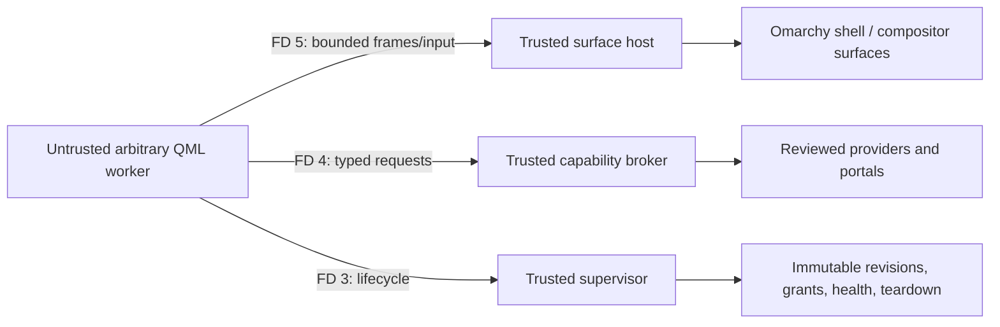

# Draft discussion: securing Omarchy plugins without giving up arbitrary QML

> Draft only. Do not post until the G4 review gate closes. The package-repository, fresh-ISO/VM, and production-host limitations below remain release blockers.

## Summary

Today, enabling a third-party Omarchy plugin means loading arbitrary QML into `omarchy-shell`. That code shares the shell's process, QML engine, environment, filesystem access, Wayland/session-bus access, injected shell objects, and ability to run commands. The current warning is honest, but there is no technical boundary behind a granular permission prompt.

This proposal keeps the feature that makes the ecosystem distinctive: plugins may still author arbitrary QML, including custom controls, animations, transparent pets, overlays, panels, slide-outs, and unusual layouts. Secure QML runs in a separate Bubblewrap sandbox and renders offscreen. Omarchy owns the compositor surface and receives only bounded frame data, then forwards bounded input and lifecycle events. Everything outside the plugin's private scene and state crosses an authenticated, typed, user-granted broker operation.

The key distinction is pixels versus authority. A plugin controls its pixels inside a granted host-owned envelope. It does not receive the normal Wayland socket, create privileged layer-shell surfaces, run arbitrary host commands, mount the user's home, use the session bus, or select its own identity and permissions.

This branch includes the current protected `quattro` history and is a reference implementation and security proof, not a production-ready replacement for today's plugin path. The native contracts, sandbox, authenticated channels, offscreen QML worker, frame transport, broker, grants, lifecycle, recovery, representative fixtures, migration reports, and adversarial tests exist and have passed their focused gates. The package installs one `Omarchy.PluginHost` QML module containing both `PluginHostInfo` and `RemotePluginSurface`, but the host remains deliberately unavailable and feature-gated; the production executable does not yet compose the full lifecycle/broker/render path, the package recipe is not committed in the package repository, and a clean fresh-ISO VM run has not happened.

## Proposed boundary

The worker is launched from one immutable, content-addressed revision with an empty synthetic home, private runtime and scratch space, filtered environment, no ambient display/bus/network/device/agent authority, and only the three role-specific inherited channels. Kernel credentials, pidfd lifetime, the selected plugin/revision/generation, and protocol negotiation bind those channels. Requests cannot choose another plugin identity.

The first render profile uses Qt Quick software rendering into host-created fixed-capacity shared memory. The host validates all untrusted metadata and copies a coherent frame into trusted memory before presentation. The host decides the surface role, monitor, bounds, z-order class, focus policy, input region, lock-screen eligibility, and frame budget. Plugin QML still owns the complete scene graph within those constraints.

The broker exposes a closed operation registry rather than ambient `network`, `filesystem`, `process`, `D-Bus`, or `Wayland` grants. The current reference providers are `storage.private@1`, `notifications.send@1`, `audio.play-cue@1`, and `service.fake-status@1`. Every request is checked against the exact active revision, generation, policy fingerprint, grant scope, grant epoch, gesture rule, input/output bounds, and provider schema. Authorization and audit admission precede provider effects.

## What is implemented and what is proven

| State | Evidence |
|---|---|
| Implemented reference components | Strict schema-v2 manifests and identities; immutable revision/grant/audit stores; staged lifecycle and rollback; Bubblewrap launcher; authenticated three-role channels; arbitrary-QML worker; two-slot frame transport; trusted bridge/surface policy; broker and four provider families; permission/audit CLIs; health, crash, revocation, removal, and recovery logic |
| Executable vertical slices | Pomodoro-style arbitrary QML in a bounded bar slot; transparent animated pet with alpha and irregular input in a desktop overlay; authenticated fake-service action with denial, auditing, handles, and revocation |
| Security proof | Real Bubblewrap denial of home, sibling state, network, session bus, ordinary Wayland, agent sockets, descendants, revision writes, forged peers, stale generations, and confused-deputy routing; malformed protocol/frame and exhaustion campaigns; update, rollback, disable, remove, crash, and restart recovery campaigns; a 64 MiB decoded-image allocation ceiling that rejects a sub-1 MiB compressed 4,097-square PNG; and bounded post-pidfd-readiness child reap |
| Visual/performance proof | Offscreen DPR1/DPR2 pet and narrow/wide Pomodoro artifacts; local software-render p95 remained below 0.5 ms in Debug, Release, and ASan/UBSan samples; click-to-changed-frame was about 66–68 ms. These exclude channel scheduling, compositor upload, presentation, and display latency and are not release guarantees |
| Packaging proof | A clean detached clone at `7aaa9b4883d20f4c5d054e9ef281a7feb06d1655` produced `omarchy-dev-4.0.0.r1946.g7aaa9b4-1-x86_64.pkg.tar.zst` with SHA-256 `7f85d031571eb5d7a1cd8d1144abf06260a834a001b17f8f90a805e5bb6874a8`; its Release package check passed 54/54 aggregate CTests, and both the archive verifier and its negative mutation suite passed |
| Not yet proven | Committed package-repository recipe, fresh ISO build/install, live Quickshell import, compositor presentation, fractional-DPR/live-hotplug behavior, production host composition, end-user activation, or a supported secure-plugin release |

The strongest rule for reviewing this branch is that a passing component, package, or fixture test is not the same claim as installed production integration. The installed `RemotePluginSurface` proves the intended QML ABI and disconnected state, not a live plugin. `PluginHostInfo.available` remains false, the graphical acceptance explicitly displays `ACTIVATION FEATURE-GATED`, and schema-v2 activation is not wired into the current end-user plugin commands.

After merging the current protected `quattro`, fresh outside-confinement Debug and Release builds each passed 54/54 native CTests. The repaired teardown boundary then passed 100/100 fake-launch and 100/100 real-Bubblewrap Release repetitions. Five focused repository/plugin/QML tests and `./test/cli` passed. The aggregate shell run reported seven failing files out of 212; none was a plugin-security test, and the recorded causes are companion-repository skew, managed-environment state, one isolated pass after removing `NO_COLOR`, and one transient isolated pass. These results strengthen the reference proof but do not substitute for the pending matching-recipe fresh-ISO VM gate.

## Existing plugins: what survives and what changes

We inspected a capability-stratified sample of 20 repositories from a marketplace snapshot containing 1,575 sources and 1,613 expanded catalog entries. The complete pinned study is in [`plugin-security-examples.md`](https://github.com/jacob-vincent-mink/omarchy/blob/plugin-security-model/plans/plugin-security-examples.md), and the executable dry-run evidence is in [`plugin-security-f6-representative-migrations.md`](https://github.com/jacob-vincent-mink/omarchy/blob/plugin-security-model/plans/plugin-security-f6-representative-migrations.md).

Fourteen of the 20 pinned trees produced deterministic bounded inventory snapshots. Six failed closed because a preview image, documentation image, or font exceeded the scanner's current 1 MiB per-file bound. Those are explicit migration-tool blockers, not clean results. Manual comparison also found that successful static scans missed the Docker monitor's effective Docker authority and Textify's Rust capture/OCR/clipboard authority. The inventory is therefore advisory and cannot create a request, grant, install decision, or safety claim.

The migration results fall into four practical lanes:

- Local QML such as Pomodoro or journal UI keeps most models and visual QML. Root surfaces become host-owned, and direct files/processes become private storage or named operations.
- Service-backed UI such as Basecamp, Docker, Mihomo, or Spotify keeps its views and much domain logic but needs a reviewed provider with enumerated operations and exact scopes. Mounting a CLI socket or granting generic execution is not the migration.
- Sensitive desktop integrations such as credentials, clipboard reads, input insertion, capture, default handlers, package updates, Bluetooth, or compositor mutation need trusted portals or narrowly constrained host operations, often with fresh gestures and composed-risk warnings.
- Plugin managers and complete shell suites are different trust classes. A storefront may keep custom QML while calling Omarchy's trusted lifecycle service, but a third-party `plugins.manage` grant would defeat the model. A full shell replacement is a reviewed host extension or a set of decomposed secure plugins, not an ordinary sandboxed plugin with every permission.

The three executable conversions deliberately cover the first usable breadth: Pomodoro proves local status and storage/effects, the transparent pet proves arbitrary expressive overlay QML, and the fake Basecamp-style provider proves authenticated service operations without needing a real account.

## Permission and update behavior

Manifest declarations are requests, never grants. Install and update review shows the full canonical plugin ID, complete revision digest, policy fingerprint, generation, surface target, required/optional status, scope, and every permission delta. New, expanded, incomparable, or required/optional-changed authority requires an explicit per-capability decision. `--yes` never grants permissions, and noninteractive review fails before mutation.

Updates stage a new immutable revision while the old healthy revision remains active. Identical or narrowed requests may inherit reviewed authority; expansions require decisions bound to the exact candidate identity. Candidate health and permission review both gate activation. Successful promotion tears down old channels, requests, surfaces, and handles. Ambiguous teardown poisons/quarantines rather than admitting a replacement. A failed activation or promotion preserves or rolls back to the prior healthy authority with a fresh generation.

Revocation is audit-first, denies new operations immediately, cancels in-flight work where the capability requires it, advances grant epochs so handles become stale, and restarts the worker when a future reviewed capability declares that mode. Disable, remove, and reinstall recovery tests prove that stale revisions and grants do not resurrect.

## Compatibility and rollout

Schema-v1 QML cannot become granularly safe while it still executes inside `omarchy-shell`. Its only honest posture is one indivisible `unsafe.host-code` decision or refusal to load. This proposal does not silently reinterpret legacy permissions as enforceable.

A practical rollout would be:

1. Land immediate legacy lifecycle hardening independently: immutable staged updates, stronger validation, explicit unsafe labeling, and no automatic permission implication from `--yes`.
2. Keep schema v2 behind a feature flag while the native host is integrated, package ownership is settled, and fresh-ISO tests prove the installed boundary.
3. Ship the SDK, migration worksheet, Pomodoro/pet/service examples, permission review, audit inspection, and developer workflow before changing the default for new third-party plugins.
4. Add capability families only with a closed provider/portal schema, adversarial tests, and comprehensible composed-risk UX. Unsupported operations remain denied.
5. Preserve an explicit power-user host-extension/developer mode for arbitrary in-process QML, but label it as full session authority rather than a secure plugin.
6. After viable ecosystem migration, require explicit unsafe mode for new schema-v1 installs and decide a transition policy for already-enabled legacy plugins.

The software renderer is an intentionally incomplete first profile. It does not provide every Qt Quick feature, notably `ShaderEffect` and particles, and pixels alone do not solve accessibility, IME, drag and drop, plugin-owned popups, or cursor semantics. Those are compatibility work, not reasons to move untrusted QML back into the shell. A restricted GPU profile and semantic side channels should be reviewed as explicit follow-ons.

## Questions for review

1. Is the core boundary acceptable: arbitrary QML remains unrestricted as scene code, while surfaces and all system effects are host-owned and brokered?
2. Which surface roles must be in API v1: `bar-embedded`, `panel`, `popover`, `slideout`, `desktop-overlay`, `desktop-underlay`, `ordinary-window`, or full `bar-replacement`?
3. Which focus, full-screen coverage, z-order, monitor, input-region, and lock-screen restrictions must be fixed invariants rather than user-grantable options?
4. Which real provider family should follow the four reference providers? Good candidates are a Basecamp-style authenticated service, media observe/control, or a file portal; capture, credentials, input injection, Docker, package updates, and compositor mutation should remain denied until their trusted UX is designed.
5. What evidence should be mandatory before a restricted GPU/zero-copy profile can replace the copied software path?
6. How should accessibility, IME, drag and drop, popups, tooltips, and cursor state cross the remote-view boundary without exposing trusted objects?
7. Should existing enabled schema-v1 plugins receive one transition release, be disabled immediately, or require confirmation on their next update?
8. Should `unsafe.host-code` be available in ordinary settings, CLI only, or only after enabling developer mode?
9. May users opt into unattended updates when the exact permission fingerprint is unchanged, or should every code revision require confirmation?
10. Which package owns the native runtime, and should higher-risk providers be isolated into separate services rather than linked into the main host?
11. What publisher identity, signing, revocation, and marketplace-attestation model should follow the runtime boundary without becoming a substitute for sandboxing or local content identity?

## Requested review outcome

The discussion should settle the boundary and rollout, not bless every placeholder API. If there is agreement that secure plugins keep arbitrary QML in an untrusted renderer while Omarchy owns surfaces, identity, lifecycle, permissions, and effects, the reference PR can be reviewed as a proof of that boundary. Capability families and compatibility features that have not crossed the same review bar remain denied and move to dependency-linked follow-up work.
