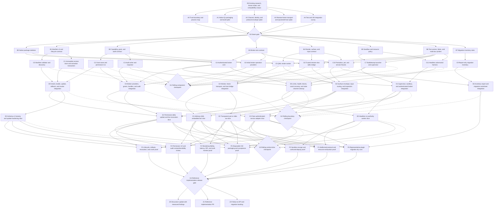

# Plugin Security Work Graph

## Purpose

This graph decomposes the secure plugin model into independently reviewable work nodes and orders them for breadth-first execution. The objective is to expose uncertain seams early, keep the native rendering critical path moving, and let sandbox, lifecycle, permission, broker, migration, fixture, and test work proceed concurrently.

The graph describes implementation order, not necessarily one pull request per node. Nodes that own disjoint files and have stable contracts can share a pull request; nodes that change a security boundary should remain independently reviewable even when they land in the same integration branch.

## Live tracker

This table is the durable execution ledger. Update it when a node is assigned, changes state, produces evidence, or discovers a blocker. `ready` means every direct prerequisite is complete; `active` means an owner is currently producing the node's exit artifact; `review` means the artifact exists but has not passed its checkpoint; `complete` means its checkpoint evidence passed; and `blocked` requires a named unmet dependency or failed experiment.

| Node | State | Owner | Evidence or blocker |
|------|-------|-------|---------------------|
| `R0` | complete | primary | [`plugin-security.md`](plugin-security.md) and [`plugin-security-examples.md`](plugin-security-examples.md) |
| `A0` | complete | `wave0_trust_map` | [`plugin-security-a0-trust-map.md`](plugin-security-a0-trust-map.md); exact current/proposed authority map reviewed |
| `A1` | complete | `wave0_native_build` | [`plugin-security-a1-native-build.md`](plugin-security-a1-native-build.md); native probe and CTest pass |
| `A2` | complete | `wave0_channel`, `wave0_native_build` | Base channel, hardened Bubblewrap FD 3/4/5 identity, pidfd lifetime, and 40-byte envelope/state/descriptor proofs pass focused, integrated, and hostile review; json-c remains a Bubblewrap-spike-only dependency |
| `A3` | complete | primary | [`plugin-security-a3-render-transport.md`](plugin-security-a3-render-transport.md), [`plugin-security-a3-host-module.md`](plugin-security-a3-host-module.md), no-display animation, dynamic Quickshell module, and bounded memfd copy proofs pass |
| `A4` | complete | `wave0_channel` | [`plugin-security-a4-test-survey.md`](plugin-security-a4-test-survey.md); all graph nodes mapped to exact test layers |
| `G0` | complete | primary | [`plugin-security-g0-seams.md`](plugin-security-g0-seams.md); complete Wave 0 harness passes and two rounds of hostile review found no remaining seam blocker |
| `B0` | complete | `wave0_native_build` | Commit `96ebb07f`; inert host/worker/bridge skeleton, service/migration wiring, staged install, QML import, direct-worker denial, and focused tests pass |
| `B1` | complete | `wave0_trust_map` | Commit `5c43562b`; strict manifest v2, canonical SHA-256 identities/goldens, opaque capability requests, and failure-safe activation/rollback contract pass strict and sanitized tests |
| `B2` | complete | `wave0_trust_map` | Commit `d80637aa`; capability, grant, update-delta, live-revocation, handle, gesture, and authoritative audit contracts pass strict and sanitized tests |
| `B3` | complete | `wave0_channel` | Commit `512f96a0`; Qt-free 40-byte wire, negotiation/readiness, fixed-capacity direction-scoped correlation, common goldens, and role registry pass strict and sanitized tests |
| `B4` | complete | primary | Commit `b78157b4`; two-slot memfd publication, checked layout, exact two-phase render request pairing, reentrancy denial, surface/input, software-profile, and bridge contract pass strict, sanitized, and hostile review |
| `B5` | complete | `wave0_native_build` | Commit `f424a3a8`; pure deny-by-default Bubblewrap/seccomp/resource plan and real synthetic authority-denial probe pass focused and sanitized tests |
| `B6` | complete | `wave0_native_build` | Commit `ec2fbf20`; literal cross-contract fixtures, deterministic fakes, malicious peers, real credential/pidfd/FD tests, sanitizers, and bounded fuzz smoke pass |
| `B7` | complete | `wave0_trust_map` | Commit `4fb33150`; bounded report-only scanner, deterministic taxonomy/worksheet, representative fixtures, and no-follow hostile tests pass |
| `C0` | complete | `wave0_channel` | Commit `6acb0c43`; bounded non-executing discovery, trusted identity pins, v2 gate, v1 unsafe diagnostics, ambiguity denial, and hostile tests pass |
| `C1` | complete | `wave0_channel` | Commit `02bebcd2`; descriptor-relative immutable staging, re-verification, atomic activation/recovery, fresh-generation rollback, and protected retention pass strict, sanitized, and fault-injection tests |
| `C2` | complete | `wave0_trust_map` | Commit `1af2dcd6`; owner-only no-follow grant store, atomic persistence, exact activation binding, update previews, monotonic decisions/epochs, v2 gate, and hostile CLI/filesystem tests pass |
| `C3` | complete | `wave0_channel` | Commit `969d22b9`; owner-only no-follow audit store, contiguous durable sequence, crash-safe bounded retention, corruption recovery, fingerprints, and redacted typed queries pass strict and sanitized tests |
| `C4` | complete | primary | Commit `c0edb6c3`; closed broker schema, per-request B3+B2 authorization, bounded providers, exact terminal/cancellation/revocation state, pre-side-effect provider validation, and reentry denial pass strict, sanitized, and hostile review |
| `C5` | complete | `wave0_trust_map` | Commit `80a928c8`; arbitrary-QML offscreen worker, strict entry/import/object bounds, exact channels, B4 publication/input lifecycle, steady seccomp, and hostile expressive/object-bomb fixtures pass aggregate and sanitized suites |
| `C6` | complete | `wave0_channel` | Commit `b96a85d5`; bounded trusted pixel/input transport, surface lifecycle, focus/inspection controls, rebind guard, and adversarial fake-producer tests pass debug, release, and sanitized suites |
| `C7` | complete | `wave0_native_build` | Commit `d628c6be`; production Bubblewrap launcher, exact FD/identity validation, seccomp, pidfd/credential binding, transient user scope resource enforcement, bounded teardown, and aggregate/real-host proofs pass |
| `C8` | complete | `wave0_native_build` | Commit `e1567df7`; closed seven-operation provider set, exact bounded schemas, binding/epoch rechecks, cancellable fake service, monotonic revocation, and fail-closed pre-bound effects pass focused, aggregate, and sanitized suites |
| `C9` | complete | `wave0_trust_map` | Commit `9dbfc12a`; bounded no-follow installed/built-in aggregation, deterministic identities and worksheet, explicit failure states, advisory snapshots, and current-tree/focused/CLI proofs pass |
| `C10` | complete | primary | Commit `e7af76e5`; custom Pomodoro, transparent pet, and fake-status QML scenes load through authority-free named-operation mocks in debug, release, and sanitized suites |
| `C11` | complete | primary | Commits `927506af` and `44fc3b53`; real-request role/generation/size attacks, leak-free descriptor floods, descendant denial, bounded failure cleanup, and actual-home/bus/Wayland Bubblewrap proof pass debug, release, full trusted-path sanitizers, stress, and hostile review |
| `D0` | complete | `wave0_native_build` | Commit `6b257bfb`; pinned lifecycle manager integrates discovery, immutable revisions, durable grants/rollback, staged permission expansion, exact recovery/rebind, v1 exclusion, CLI, aggregate, and sanitized proofs |
| `D1` | complete | `wave0_channel` | Commit `a97885d7`; exact launch identity and pidfd binding, three-role negotiation/readiness, authenticated broker ingress, role-bounded nonblocking sends, malicious peers, descriptor cleanup, and fatal teardown pass debug, release, sanitizer, and real-Bubblewrap proofs |
| `D2` | complete | `wave0_trust_map` | Commit `38ae3f0d`; bounded worker-to-host rendering preserves arbitrary QML pixels while enforcing profile/allocation order, exact descriptor transfer, stale and malformed frame rejection, resize/DPR handling, and fail-closed teardown |
| `D3` | active | `wave0_trust_map` | Named surface envelope, input/focus gates, lock-screen denial, and host-owned inspection integration in progress |
| `D4` | complete | `wave0_native_build` | Commits `044a2dd0` and `d54d1309`; provider effects are audit-gated, revocation and cancellation are exact-epoch audited transitions, handles are binding/scope/epoch constrained, poisoned runtimes cannot resolve prior handles, and recovery cannot resurrect authority |
| `D5` | complete | `wave0_native_build` | Commit `05edd5b0`; exact bounded requests/surfaces, readiness and pidfd health, crash backoff/disable, unresolved-worker recovery, redacted supervisor audit, and ambiguous-teardown quarantine pass strict, aggregate, sanitized, and adversarial tests |
| `D6` | complete | primary | Commit `f0eaaeba`; bounded trusted scanner composition produces deterministic advisory today-to-tomorrow maps for Pomodoro, pet, and service fixtures with exact schema-v2 candidate identities, surfaces, and capability scopes |
| `E0` | active | primary | Headless no-ambient-authority worker, authenticated channel, health limits, and clean termination vertical slice in progress |
| `E4` | active | `wave0_native_build` | Permission-expanding update and live-revocation vertical slice in progress |
| `E5` | complete | `wave0_native_build` | Commit `debe83d3`; v1 has only an unsafe/unmigrated posture, while exact reinstall, upgrade, exact-digest downgrade/rebuild approval, identity denial, and fault recovery pass strict and sanitized proofs |

Nodes not listed here remain `pending` as represented by the graph. Add them to the live table when they become `ready`; completed rows remain as an audit trail rather than being removed.

## Execution rules

- Merge contracts and executable skeletons before competing implementations, but keep contract work narrow enough that it does not become a speculative API-design phase.
- Every node produces a testable artifact, not only prose. A contract node must include schemas, test vectors, a stub, or a probe that a downstream node can consume.
- Workers build against versioned protocol fixtures and fakes so they do not wait for peer implementations.
- Security enforcement stays on the trusted side. Plugin SDK helpers and QML shims are clients of policy, never policy authorities.
- Denied and unsupported behavior is an acceptable intermediate result. A wave does not broaden authority merely to make a later fixture work.
- Schedule breadth-first but remain work-conserving: take the lowest-wave ready node, and do not idle a lane merely because an unrelated node in the same wave is unfinished.
- `G1`, `G2`, and `G3` are rolling evidence checkpoints, not global barriers. A descendant starts when its listed parents pass their portions of the checkpoint. Only `G0`, which freezes shared seams, and `G4`, which authorizes the reference release, are whole-graph barriers.
- Keep schema v2 behind a feature flag until the system proof wave passes. Schema v1 remains explicitly unsafe and must never be reported as granularly sandboxed.

## Graph

## BFS waves

### Wave 0: De-risk the seams

These nodes run immediately and in parallel. Each should be a short spike ending in a recorded decision and an executable proof.

| Node | Deliverable | Exit condition |
|------|-------------|----------------|
| `A0` | Exact process, filesystem, socket, credential, and policy-authority map | Every trusted component and cross-boundary channel has one owner |
| `A1` | Minimal Qt 6 executable and QML module built and packaged through an Omarchy-compatible path | A disposable environment can install and run the native artifact |
| `A2` | Private inherited channel prototype, worker identity binding, message framing, version negotiation, and size limits | A worker can exchange typed messages but cannot choose its plugin identity |
| `A3` | Animated arbitrary-QML frame producer and trusted Quickshell consumer experiment | We have measured evidence for a first transport and know the required native bridge shape |
| `A4` | Exact unit, shell, acceptance, packaging, and security-test entry points | Every later node knows where its tests run and which tests require a disposable VM |

`G0` freezes only the seams needed to parallelize: native artifact ownership, channel bootstrap, common message envelope, initial frame transport, protocol versioning rule, and test locations. It does not settle later capability families or every QML compatibility behavior.

### Wave 1: Define contracts and scaffolds

All `B*` nodes start after `G0`. They should own separate schema or scaffold files so they can land concurrently.

| Node | Primary output |
|------|----------------|
| `B0` | Build targets, install layout, development invocation, version reporting, and empty trusted/worker executables |
| `B1` | Manifest v2 schema, content identity, requested-capability fingerprint, staged revision states, and activation state machine |
| `B2` | Capability request, scope, grant, denial, revocation, gesture, handle, and redacted audit record schemas |
| `B3` | Broker request/response/error/event definitions, channel authentication rules, bounds, cancellation, and compatibility fixtures |
| `B4` | Surface creation, frame, damage, resize, DPR, theme, input, focus, lifecycle, inspection, and termination definitions |
| `B5` | Bubblewrap mounts and namespaces, inherited descriptors, environment allowlist, cgroup limits, process model, and teardown rules |
| `B6` | Shared golden messages, fake peers, malformed inputs, sandbox probes, test certificates of expected denial, and fixture conventions |
| `B7` | Static inventory findings, severity taxonomy, known false positives, and migration worksheet format derived from the representative corpus |

### Wave 2: Build isolated components

The `C*` nodes are the widest implementation wave. No component may require a live implementation from another lane; it consumes the contracts and fakes from Wave 1.

| Lane | Nodes | Parallel work |
|------|-------|---------------|
| Lifecycle | `C0`, `C1` | Parse and discover v2 plugins while independently building the immutable source/revision transaction |
| Permission authority | `C2`, `C3` | Store and mutate grants through CLI while separately recording and querying redacted audit events |
| Broker | `C4`, `C8` | Build channel authentication, validation, dispatch, and denial separately from private storage, notification, named-audio, and fake-service providers |
| Runtime | `C5`, `C7` | Build an unprivileged QML render worker independently from the sandbox launcher and supervisor |
| Trusted shell | `C6` | Build the narrow native/QML bridge against a fake frame producer; it owns pixels and input transport but no grants or policy |
| Migration | `C9` | Build the report-only inventory against pinned and synthetic fixtures |
| Product fixtures | `C10` | Build QML scenes and fake service data against SDK mocks without host authority |
| Security tests | `C11` | Build malicious workers and denial assertions against fake channels and a standalone sandbox harness |

`G1` is a rolling checkpoint, not a feature-completeness barrier. Each component passes its isolated tests, matches golden protocol fixtures, has explicit ownership, and can fail closed when its peer is absent or incompatible before its own descendants start.

### Wave 3: Integrate boundaries in pairs

Pairwise integration keeps failures attributable. Each `D*` node starts as soon as its listed `C*` parents pass their portions of `G1`; it does not wait for unrelated components.

| Node | Boundary under test |
|------|---------------------|
| `D0` | Manifest validator + revision store + permission store |
| `D1` | Supervisor + Bubblewrap sandbox + authenticated broker channel |
| `D2` | QML worker + bounded frame transport + trusted host bridge |
| `D3` | Host bridge + surface policy + input/focus routing + host-owned inspector |
| `D4` | Broker core + providers + current grants + handles + audit records |
| `D5` | Supervisor + resource controls + health checks + crash-loop and channel cleanup |
| `D6` | Inventory findings + compatibility corpus + generated author worksheet |

`G2` applies independently to each boundary and requires cross-boundary negative tests. A happy-path demonstration alone is insufficient: incompatible versions, stale revisions, forged identity fields, invalid surface requests, oversized frames, missing peers, and revoked grants must fail closed.

### Wave 4: Assemble vertical slices

Each `E*` slice starts when its required boundaries pass `G2`, and the slices deliberately exercise different authority shapes.

| Node | What it proves |
|------|----------------|
| `E0` | A worker can start with no ambient authority, use an authenticated channel, be resource bounded, and terminate cleanly without any UI |
| `E1` | Arbitrary animated QML renders in a host-assigned bar rectangle, receives bounded input and presentation state, and cannot obtain shell authority |
| `E2` | Alpha, animation, irregular input regions, and a pet or slide-out remain expressive while surface count, placement, z-order, focus, monitor, and frame limits remain host-owned |
| `E3` | A custom QML service UI uses only enumerated fake-adapter operations; undeclared operations, URL actions without a gesture, and expanded scopes are denied |
| `E4` | A permission-expanding update stays staged, the old revision remains active, accepted activation is atomic, and revocation invalidates workers and handles immediately |
| `E5` | Schema v1 is labeled and controlled as indivisible unsafe host code, while validation and update hardening improve without making false sandbox claims |

### Wave 5: Prove the system

Each `F*` proof node starts when its required vertical slices pass `G3`. The proof campaigns converge on the same release candidate before `G4`; findings return to the owning `C*` or `D*` node and do not get patched only in the fixture.

| Node | Proof campaign |
|------|----------------|
| `F0` | Filesystem, network, D-Bus, Wayland, agent-socket, cross-plugin, identity-forgery, stale-handle, and confused-deputy attacks |
| `F1` | Malformed and oversized messages, invalid frames, excessive rates, output floods, memory/CPU/process exhaustion, crash loops, and restart storms |
| `F2` | Animation and input latency, frame pacing, software-render cost, alpha, clipping, narrow/wide layouts, DPR changes, monitor changes, focus, and visual inspection |
| `F3` | Install, enable, staged update, approval, rollback, disable, revoke, remove, failed health check, worker crash, broker restart, and shell restart |
| `F4` | Capability wording, required versus optional choices, permission diffs, plugin surface identity, inspection, termination, audit usefulness, and spoof resistance |
| `F5` | Clean install and packaging plus graphical acceptance in the disposable Omarchy VM |
| `F6` | Attempted conversions of one local-status widget, one freeform overlay, and one authenticated service using the pinned migration corpus |

### Wave 6: Publish and split follow-ons

After `G4`, publish three outputs in parallel:

- `Z0` updates the repository discussion with the implemented trust boundary, decisions, benchmark results, attacks attempted, migration findings, limitations, and unresolved questions.
- `Z1` presents the reference implementation as a reviewable PR with the feature flag, fixtures, threat-oriented tests, visual evidence, and an explicit statement that unimplemented capability families remain denied.
- `Z2` converts deferred compatibility work into dependency-linked issues: additional surface roles, accessibility, IME, drag and drop, popup and cursor side channels, restricted GPU rendering, zero-copy transport, real service adapters, marketplace attestations, signing, and ecosystem migration tooling.

## Critical path

The likely critical path is:

`A1 native packaging` + `A3 render spike` → `B0 native skeleton` + `B4 render contract` → `C5 render worker` + `C6 trusted bridge` → `D2 render integration` + `D3 surface integration` → `E1 embedded bar` → `F2 fidelity proof` + `F5 VM proof` → `G4`.

Assign the earliest and strongest implementation capacity to `A1`, `A3`, `C5`, and `C6`. The rest of the graph should not wait on that path: fakes and golden protocol fixtures let it reach `G1` concurrently, and the headless `E0`, lifecycle `E4`, and legacy `E5` slices can expose security defects even if rendering slips.

## Suggested ownership boundaries

For maximum concurrency, use these file and authority boundaries:

| Workstream | Owns | Must not own |
|------------|------|--------------|
| Native runtime | Qt worker, frame producer, worker-side protocol client | Grants, lifecycle decisions, host surface policy |
| Trusted shell bridge | Frame consumer, event forwarding, host surface envelopes, inspection affordance | Plugin business logic, capability decisions, durable grant state |
| Supervisor/sandbox | Process creation, descriptors, namespaces, mounts, limits, teardown | Broker operation semantics, UI layout |
| Broker | Channel identity, validation, authorization lookup, dispatch, handles, operation providers | Plugin-controlled identity, shell QML state |
| Lifecycle | Manifests, revisions, staging, activation transaction, rollback | Rendering and broker payload implementation |
| Permission authority | Grants, denials, revocation, audit, CLI and trusted consent model | SDK-side enforcement |
| SDK/fixtures | QML-facing typed clients, compatibility helpers, representative scenes | Security enforcement or ambient host access |
| Verification | Golden protocols, malicious fixtures, property/fuzz tests, VM acceptance, benchmarks | Relaxing invariants to make a test pass |
| Migration | Static inventory, worksheets, corpus dry runs, author guidance | Automatic granting or claims that static analysis proves safety |

## Merge strategy

- Keep `plugin-security-model` as the integration branch until the discussion selects a landing strategy.
- Give each node a short-lived branch named `plugin-security/<node>-<topic>` and rebase it on the latest completed gate, not on arbitrary sibling branches.
- Put shared protocol fixtures in their own contract commits. Downstream branches update through those commits instead of copying definitions.
- Use feature flags and fake peers so incomplete nodes can merge without activating schema v2 for users.
- Tag gate commits `plugin-security-g0` through `plugin-security-g4` in the review fork if reviewers benefit from reproducible checkpoints; tags are optional and should not be pushed until the team agrees.
- Prefer stacked PRs within a lane and sibling PRs across lanes. Squash only after dependent reviewers no longer need the intermediate commit identities.

## Gate ownership and evidence

| Gate | Review focus | Required evidence |
|------|--------------|-------------------|
| `G0` | Are the seams small, versioned, mockable, and owned? | Spikes, measurements, process map, wire examples, build/install proof |
| `G1` | Does each isolated component honor its contracts and fail closed before descendants consume it? | Focused unit tests, golden vectors, fake-peer tests, code-owner review |
| `G2` | Does each pairwise boundary preserve identity, bounds, lifecycle, and denial before its slices consume it? | Negative integration tests and teardown/recovery tests |
| `G3` | Does each useful end-to-end slice preserve expression without ambient authority before proof campaigns consume it? | Working fixtures, adversarial assertions, permission and audit traces |
| `G4` | Is the reference safe, installable, understandable, and honest about limitations? | Security campaigns, benchmarks, visual verification, VM acceptance, migration dry runs |

No checkpoint may be waived because a dependent lane is idle. If a checkpoint fails, unaffected ready nodes continue; only descendants of the failed contract, boundary, or slice pause. This preserves BFS priority without introducing unrelated global barriers.
