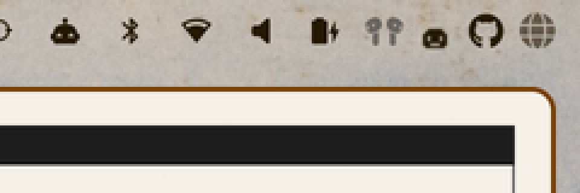
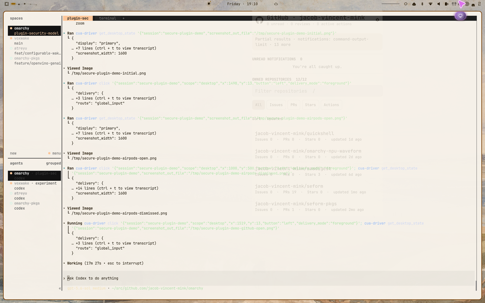
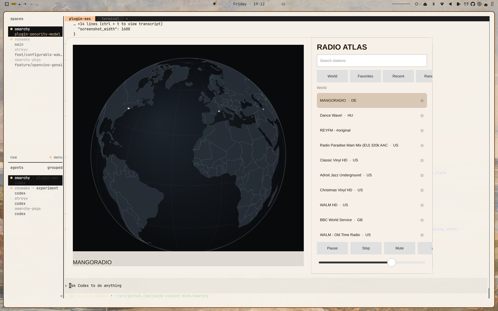
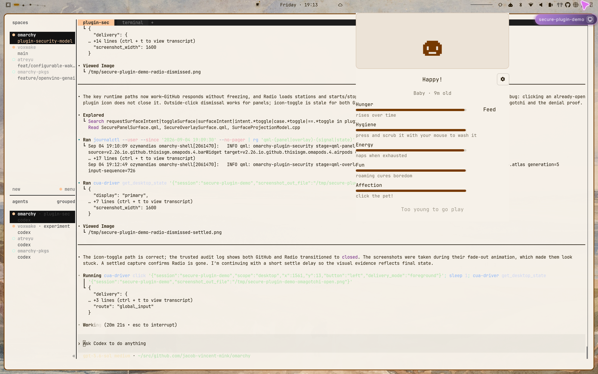
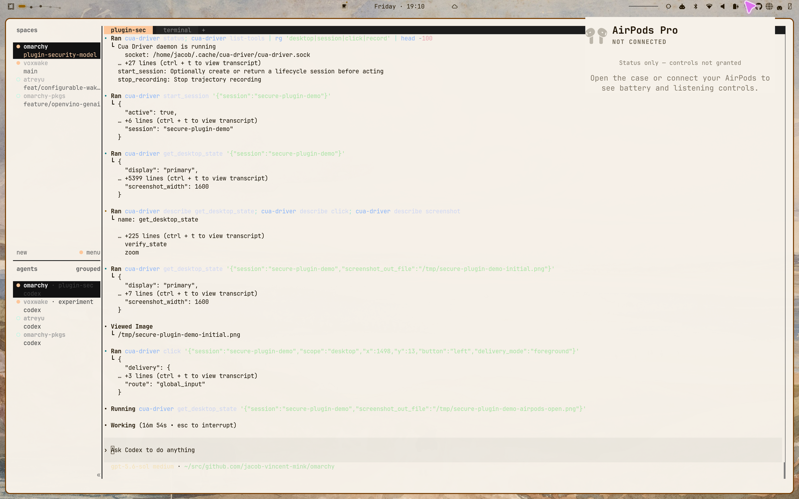
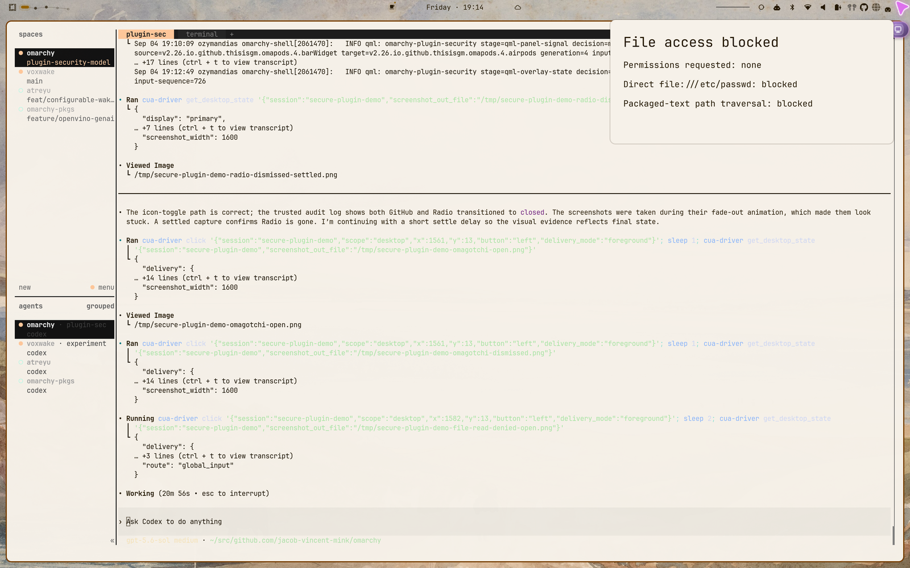

# Plugin security live proof

This branch preserves the source and screenshots from the 2026-09-04 live proof against `plugin-security-model-slim` commit `24d3f307`.

One authoritative Quickshell hosted five distinct Bubblewrap workers: the four winner plugins and `org.omarchy.security-demo.file-read-denied`. GitHub returned live `gh` data without freezing the shell, Radio loaded 40 stations and played then stopped an opaque media handle, Omagotchi opened at the bar edge, and AirPods rendered its truthful disconnected state. Every surface opened and closed through native shell input.

The adversarial plugin requests no required or optional permissions. It attempts both a direct `file:///etc/passwd` request and a `runtime.readPackagedText("../../../../etc/passwd")` traversal. The live panel reported both attempts blocked. Host-side inspection also found no `/etc/passwd` below the worker root, an isolated network namespace, and Bubblewrap flags `--unshare-user --unshare-pid --unshare-ipc --unshare-uts --unshare-net --unshare-cgroup --disable-userns --cap-drop ALL --clearenv`.

The exact accepted archive is [`file-read-denied-v2.ustar`](adversarial/file-read-denied-v2.ustar), SHA-256 `5d2a6c5004f7bb338230dd27d6f96fab3540a3ef03985fa83e924b6a950d7068`. Its auditable source is beside it in [`adversarial/file-read-denied`](adversarial/file-read-denied).

Install the archive against a running secure runtime with:

```bash
omarchy plugin secure-install ./plugin-security-proof/adversarial/file-read-denied-v2.ustar
```

The expected permission review says `No permissions requested.` The shield icon opens a panel that must report both reads as blocked. Any displayed `BREACH` is a test failure.

The screenshots under [`screenshots`](screenshots) are retained evidence, not product assets.

### Four native winner slots



### Brokered effects and isolated presentation









### Visible denial



## Exact winner heads

- GitHub: `jacob-vincent-mink/omarchy-github`, branch `secure-plugin-v2`, commit `fd31410ea438fc7ef87c51bcc4d1a7449995ace7`
- Radio Atlas: `jacob-vincent-mink/omarchy-radio-atlas`, branch `secure-plugin-v2`, commit `815afb9b3dc7b0c827ed4ac78abb11732386fe2f`
- Omagotchi: `jacob-vincent-mink/omagotchi`, branch `secure-plugin-v2`, commit `d73f6ffe97be8e9a8ee34ed65d4e985c3f8bb263`
- AirPods: `jacob-vincent-mink/omarchy-pods`, branch `secure-plugin-v2`, commit `bfd49b712cbebee822d01dc2cdf81e43ea3526a7`
